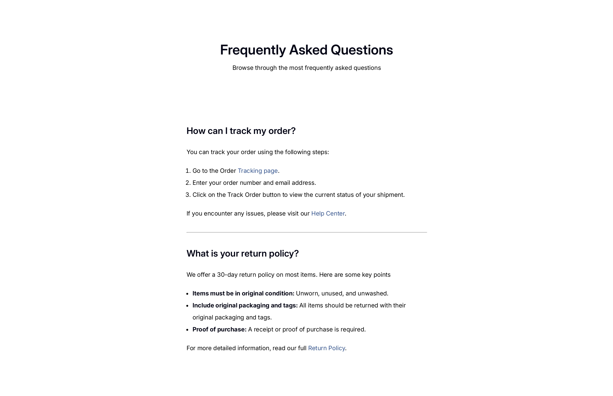

# 📄 FAQ Page

Welcome to my **FAQ (Frequently Asked Questions) page** project! 
This is a simple and responsive beginner web development project  built using **HTML and CSS**.  

---

## 📌 Overview  

This project is a **responsive FAQ (Frequently Asked Questions) page** built using **HTML and CSS**. It provides users with quick and clear answers to common questions in a clean, minimal, and user-friendly layout.  

The page includes: 
- 📖 A centered heading section with the title and short description  
- ❓ Multiple FAQ entries with answers displayed using ordered and unordered lists  
- 🎨 A simple, elegant design with semantic HTML for accessibility  
- 📱 Responsive layout optimized for desktop, tablet, and mobile screens  

### Screenshot 📱
  

### Links 🔗
- Live Demo: [View Project](https://dev-faq-pages.netlify.app)  
- Source Code: [GitHub Repository](https://github.com/sameer-srb/simple-FAQ-pages)

## 🚀 My process

### Built with

- 
- 
- 

### What I learned 📑
While working on this project, I learned:
- How to structure semantic **FAQ sections** using `<section>`, `<h2>`, `<ol>`, `<ul>`, and `<a>` tags.
- Applying **responsive design** with media queries (`@media` for tablets and mobiles).
- Styling **lists, links, and dividers** for better readability.
- Importance of **container max-width** for cleaner layouts.

### Useful resources 📚 
- [MDN Web Docs – HTML](https://developer.mozilla.org/en-US/docs/Web/HTML)  
- [MDN Web Docs – CSS](https://developer.mozilla.org/en-US/docs/Web/CSS) 
- [devChallenges](https://devchallenges.io/learn/2-responsive-web)  
-  [Google Fonts](HTTPS://FONTS.GOOGLE.COM/)

---
## 🙏 Acknowledgments
Special thanks to **devChallenges** and **MDN Docs** for helpful resources during the development.

---

## 📬 Feedback
Suggestions or improvements welcome!  
Feel free to open an issue or reach out. 

**Author :-**

 -  - 

Created by **SAMEER** - 2025
